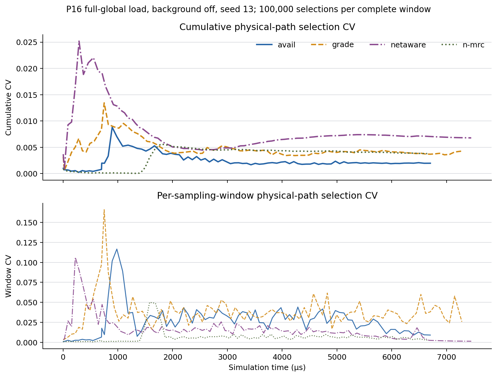

# avail、grade、netaware、n-mrc：不足、证据与适用边界

## 结论先行

四个方案没有全场景冠军。当前证据更适合得出下面的选择：

| 场景 | 更合适的方向 | 主要原因 |
|---|---|---|
| 持续、可定位的非对称热点 | n-mrc / netaware；grade 加权也有价值 | 坏路径具有持续性，主动绕行或降低其权重能获得真实收益 |
| 均匀全局大流 | avail / n-mrc | 决策稳定性比追逐短时等级更重要 |
| 长短流混合 WebSearch | netaware | n-mrc 的动态换路会伤害部分大流 |
| 热点持续性未知、配置需稳健 | 不应只用一个固定参数 | grade/netaware 的最佳权重随场景翻转，n-mrc 的最佳换路强度也随流量翻转 |

证据等级：

- **因果证实**：同 seed 只改变一个机制，三个 seed 方向一致；
- **总体支持**：配对几何均值同向，但个别 seed 持平或反向；
- **机制支持**：性能与中间指标同步变化，但仍可能有未隔离的交互；
- **尚未证实**：合理风险，目前没有足够粒度的数据。

## 路径使用 CV：最终均衡不等于短时均衡

本次新增只读采样器，在 P16、全局负载、background off、seed 13 中每 100,000 次物理路径选择记录一次八条路径的累计计数。

- **累计 CV**：从仿真开始到当前时刻的全部路径选择计数计算 CV，回答长期总量是否均衡；
- **窗口 CV**：相邻两次累计计数的差分计算 CV，回答最近 100,000 次选择是否均衡。

图的上半部分说明 avail 最终累计最均衡；下半部分却说明 avail 并不是短时最均衡。grade 的窗口波动最大，而 n-mrc 的窗口波动最小。因此，原来只看最终累计 CV，不能推出“avail 每个时刻都最均衡”。

下表和曲线的窗口统计只使用恰好包含 100,000 次选择的完整窗口；各方案最后一个不足 100,000 次的部分窗口保留在 CSV 中，但不参与汇总。

| 方案 | 最终累计 CV | 窗口 CV 均值 | 窗口 CV P95 | 窗口 CV 最大值 |
|---|---:|---:|---:|---:|
| avail | **0.00196** | 0.02710 | 0.04339 | 0.11660 |
| grade | 0.00428 | **0.03745（最高）** | 0.06093 | **0.16582（最高）** |
| netaware | 0.00677 | 0.01712 | 0.04189 | 0.10631 |
| n-mrc | 0.00377 | **0.00646（最低）** | **0.01012（最低）** | **0.05001（最低）** |

这里的 CV 是八条物理路径的选择次数 CV，不是队列长度 CV，也不是单个 ToR 对内部的局部 CV。它能证明全局选择过程的时间波动，但仍可能掩盖局部源—目的对的集中。

---

## avail

### 机制

avail 把路径简化为“可用/不可用”。默认 packet aging 下，ECN/TRIM 可把路径分数降到 0，而 clean ACK 不会让它恢复。

### 已确认的不足：路径永久降级

**总体支持，且机制计数直接对应。**

P4 中把默认策略改成允许恢复的 hybrid：

| 对照 | CCT 变化 | avoid entry | avoid exit | 结论 |
|---|---:|---:|---:|---|
| hybrid vs avail 默认 | **-9.1%** | 220,265 | **77,648** | 恢复路径池总体有益 |
| ECN-only vs avail 默认 | +2.5% | 95,330 | 0 | 只改变 ECN 老化不稳定 |

默认 avail 的 `avoid exit=0`。hybrid 在两个 seed 改善约 14%，第三个 seed 略慢约 2%，所以应写成“永久降级总体造成路径池退化，但对流量映射敏感”，不能写成每次必然有害。

### 已确认的特点：长期最均衡，但短时仍有偏斜

P16 时序实验中，avail 最终累计 CV 为四方案最低的 0.00196；但是完整窗口 CV 均值为 0.02710，是 n-mrc 的约 4.2 倍，也高于 netaware。

这说明 avail 的二值机制最终会把总量摊平，但过程中仍可能因路径被批量判为不可用而发生窗口级流量转移。原来的“最终 CV 很低”只能证明长期累计均衡。

### 其他可能不足

- **丢失严重度信息，机制支持。** MILD、BAD 被压成同类后，无法区分轻微短时 ECN 和持续严重拥塞。
- **全路径不可用时退化，数据支持。** 多个场景出现大量 avoid entry 且没有 exit；当所有路径都不可用时只能回退选择，二值状态失去区分力。
- **恢复参数存在两难，已观察到反例。** 恢复太慢会永久黑名单，恢复太快又可能重新使用仍然拥塞的路径；P4 第三个 seed 中 hybrid 略慢就是边界。
- **局部 ToR 对是否短时集中，尚未证实。** 当前时序 CV 是全局物理路径统计，需要增加 `src_leaf,dst_leaf,path_id,time_window` 才能证明局部同步转移。

### 与其他方案相比

- 相比 grade：更稳定、参数更少，但表达能力更弱且默认不恢复；
- 相比 netaware：不需要网络快照，开销低，但无法主动识别远端坏路；
- 相比 n-mrc：没有高频动态换路风险，但坏路径隔离和恢复都更迟钝。

---

## grade

### 机制

grade 使用 GOOD/MILD/BAD/AVOID 四级，并把等级映射为默认权重 `4/2/1/0`。更细粒度提供了更多信息，但信息只有在等级可靠、持续时间与权重幅度匹配时才有价值。

### 已确认的不足：均匀负载下权重放大短时状态

**因果证实。**

只把 `4/2/1/0` 改为 `4/4/4/0`：

| 场景 | 等权后的性能变化 | ECN/M 包 | 重传/M 包 | seed 一致性 |
|---|---:|---:|---:|---|
| P16 均匀全局负载 | **CCT -3.7%** | 292,861 → 256,639 | 64,143 → 60,698 | 3/3 改善 |
| P4 均匀全局负载 | **CCT -3.9%** | 319,633 → 288,202 | 125,428 → 117,926 | 3/3 改善 |

同时，grade 默认配置的完整窗口 CV 均值 0.03745、最大值 0.16582，均为四方案最高。三 seed 消融直接证明的是“权重改变会同步改变 ECN、重传和 CCT”；单 seed 时序只为下面的短时摆动解释提供机制支持，并未单独证明窗口 CV 是中介变量：

`短时等级变化 → 4/2/1 权重差异 → 窗口级路径选择摆动 → 更多 ECN/重传 → CCT 增加`

最终累计 CV 仍只有 0.00428，所以“全局累计使用不均”不是 grade 变慢的主因。

### 权重什么时候反而非常好

**因果证实，且与均匀负载结论相反。**

在持续非对称热点下，把 grade 从 `4/2/1/0` 改为等权 `4/4/4/0`：

- p99 FCT **恶化 13.8%**；
- ECN **增加 35.6%**；
- 三个 seed 全部同向。

因此问题不是“加权一定不好”，而是：

- 持续热点中，等级具有预测性，降低坏路径权重能持续避开真实瓶颈；
- 均匀高负载中，等级更多反映短时队列波动，强权重容易追逐噪声。

### 其他可能不足

- **参数和场景耦合，因果证实。** 同一组权重在热点场景有益、在均匀场景有害，不存在当前证据支持的固定最优权重。
- **等级阈值边界抖动，机制支持。** 路径在阈值附近跨级会造成离散的 4→2 或 2→1 权重变化。
- **多个发送端同步响应，数据支持但未完全隔离。** 高窗口 CV 与更多 ECN一致，但还没有按 ToR 对记录是否同时切换。
- **更细粒度增加调参和解释成本，确定存在。** 阈值、老化、权重必须共同校准；单独增加等级不会自动改善决策。

### 与 avail 的关系

grade 比 avail 差时，通常是权重过度响应的代价更大；grade 比 avail 好时，通常是 grade 能恢复，而 avail 默认永久黑名单的代价更大。

P4 默认结果就是后者：grade 约 2246 μs，avail 约 2412 μs；但 grade 改等权还能进一步到约 2159 μs。

---

## netaware

### 机制

netaware 使用网络侧路径状态快照和 GoodCap 权重自适应，把选择集中到 GOOD 路径。它比端点反馈更直接，但依赖快照时效性和网络状态是否具有持续性。

### 已确认的优势：持续热点下能识别坏路径

**因果证实。**

非对称热点中，同时改成均匀权重并关闭 GoodCap 自适应：

- p99 FCT **恶化 68.8%**；
- ECN 从 5,260 增至 10,386/M 包；
- 重传从 84 增至 1,100/M 包；
- 三个 seed 全部恶化。

所以“读取网络路径状态并按等级偏置选择”的组合机制在持续坏路场景确实有效，不是随机结果；当前对照没有进一步分离快照采集、等级权重和 GoodCap 自适应各自的独立贡献。

### 已确认的不足：均匀负载下追逐短时状态

**总体支持，但幅度映射敏感。**

P16 中关闭自适应相对默认 GoodCap：

- 配对 CCT 几何均值改善 **5.5%**；
- 两个 seed 大幅改善，一个 seed 基本持平；
- 重传从 122,536 降到 95,932/M 包。

均匀权重相对默认平均改善 4.5%，但一个 seed 反向。因此可以说 GoodCap 在均匀负载下总体不稳，不能说每个映射都必然有害。

### 路径均衡方面的边界

netaware 的最终累计 CV 最高，为 0.00677；但窗口 CV 均值只有 0.01726，低于 avail 和 grade。这表示它形成了较稳定的累计偏置，而不是一直剧烈摆动。

如果偏置指向持续健康路径，这是优势；如果快照已经过时或所有路径同样拥塞，这种偏置就可能成为负担。

### 其他可能不足

- **快照陈旧，合理风险，尚未单独注入延迟证实。** 需要扫描快照传播延迟/更新周期。
- **多发送端同步选择同一 GOOD 路径，数据支持但未完全隔离。** 累计 CV 最高说明存在偏置，但尚需 ToR 对和时间窗口级选择数据证明同步 herd。
- **网络侧测量与传播开销，确定存在但尚未量化到硬件成本。**
- **拓扑和利用率阈值依赖，合理风险。** 在不同链路速率、路径数和 oversubscription 下，当前阈值不一定可迁移。
- **所有路径都差时区分力下降，合理风险。** 此时 GOOD 比例限制可能只是在多个坏选项间重新分配。

### 与其他方案相比

- 比 avail/grade 更早看到远端状态，但依赖快照正确性；
- 比 n-mrc 更少发生端点动态换路，因此 WebSearch 混合流量更稳；
- 在没有稳定热点的均匀负载下，额外感知不一定转化为收益。

---

## n-mrc

### 机制

`better_ge3` 的准确含义是：至少存在三条严格优于当前路径的候选，才触发换路；不是“四级分级相差三级才换路”。它把网络侧比较、换路和端点冷却/FastCNP结合起来。

### 已确认的优势：热点场景换路有效

**因果证实。**

非对称热点中：

- 默认 n-mrc p99 约 403 μs；
- 禁止换路后约 703 μs，恶化 **74.8%**；
- 重传从 7 增至 992/M 包；
- 三个 seed 全部恶化。

换路是 n-mrc 热点收益的直接来源。

### 已确认的不足：混合流量中换路伤害大流

**因果证实。**

WebSearch 中禁止换路相对默认：

- p99 改善 **4.4%**；
- 三个 seed 全部改善；
- ECN 从 19,411 降到 1,122/M 包。

把门槛放宽为 `any_better` 后：

- 换路从 50,584 增到 57,258/M 包；
- p99 又恶化 **2.4%**。

所以“三条更优候选”确实是保守门槛，但这种保守具有保护作用。按流大小定位具体受害流仍需要把逐流结果作为正式证据保存后再下结论。

### FastCNP 不是稳定主因

关闭 FastCNP 相对默认只改善 0.6%，且不同 seed 方向不一致。它与换路存在交互，但不能解释稳定回退；稳定主因是动态换路链路本身。

### 路径均衡方面的特点

n-mrc 最终累计 CV 为 0.00377，不如 avail；但窗口 CV 均值仅 0.00646、P95 仅 0.01012，四方案最低。

因此 n-mrc 并不是靠高频全局流量摆动获得收益。更可能是它在局部流/路径状态上执行换路，同时总体路径选择窗口仍较平滑。

### 其他可能不足

- **流重排/路径状态失配，合理风险。** 现有 OOO 指标没有稳定解释 WebSearch 回退，因此不能写成已证实原因。
- **候选数量门槛随路径规模变化，合理风险。** 固定“至少三条”在 4、8、16 条路径下代表的相对严格度不同。
- **控制状态和实现复杂度高，确定存在。** 需要网络比较、reroute、FastCNP、cooldown 和重复通知抑制共同工作。
- **诊断仿真开销高，但不是网络性能指标。** 本次同场景带追踪运行约 341 秒，avail/grade 约 145–148 秒；这只能提示实现/仿真复杂度。
- **局部最优与端点拥塞控制耦合，数据支持。** 固定大流中换路有益，长短流混合中换路有害，说明门槛不能脱离流量结构调优。

---

## 四方案直接对比

| 维度 | avail | grade | netaware | n-mrc |
|---|---|---|---|---|
| 状态粒度 | 二值 | 四级 | 网络路径快照/等级 | 相对候选比较+端点状态 |
| 最主要优点 | 稳定、长期累计最均衡 | 能表达严重度并恢复 | 持续热点识别最直接 | 热点绕行能力强、综合成绩最好 |
| 已确认的主要问题 | 默认永久不可用 | 权重在均匀负载下放大短时波动 | 均匀负载下动态偏置不稳 | 混合流量中动态换路伤害大流 |
| 最敏感参数 | aging/hold/probe | 阈值、权重、aging | 更新周期、权重、GoodCap | reroute 门槛、cooldown、FastCNP |
| 最终累计 CV | **最低** | 中等 | 最高 | 较低 |
| 窗口 CV | 中等偏高 | **最高** | 中等 | **最低** |
| 主要工程风险 | 黑名单恢复 | 参数组合爆炸 | 遥测和快照开销 | 状态机与反馈链复杂 |

## 当前最值得继续的实验

1. **局部而非全局 CV**：按 `src_leaf,dst_leaf,path_id` 计算窗口 CV，验证 avail/grade 是否存在发送端同步迁移。
2. **热点持续时间扫描**：扫描热点 ON/OFF 周期，找出 grade 加权、netaware GoodCap 从有益翻转为有害的临界时间尺度。
3. **路径规模扫描**：4/8/16 路径下比较 n-mrc 的固定三候选门槛，考虑改成候选比例门槛。
4. **快照延迟注入**：给 netaware 状态增加传播延迟和丢失，量化 stale snapshot 风险。
5. **按流大小分层**：继续比较 n-mrc 的 reroute 次数、ECN、OOO 与 20–30 MiB 大流回退，避免总体 p99 掩盖结构性问题。

## 数据来源与复现范围

- 四方案因果消融：4 个关键场景 × 3 seed，共 72 次运行；
- grade 热点权重补充：2 个权重配置 × 3 seed，共 6 次运行；
- 路径时序：P16、background off、seed 13、四个默认方案，每 100,000 次选择采样；
- 路径时序底层数据：[`four_scheme_path_cv_timeline.csv`](four_scheme_path_cv_timeline.csv)；
- 四个原始累计路径计数：[`evidence/four_scheme_path_cv_raw/`](evidence/four_scheme_path_cv_raw/)；
- P16 固定流量矩阵：[`evidence/full_global_p16_256mib_background_off_seed13.cm`](evidence/full_global_p16_256mib_background_off_seed13.cm)；
- 72 次逐次结果：[`four_scheme_causal_results.csv`](four_scheme_causal_results.csv)；
- 同 seed 因果效应：[`four_scheme_causal_effects.csv`](four_scheme_causal_effects.csv)；
- grade 热点权重底层数据：[`four_scheme_grade_weight_asym.csv`](four_scheme_grade_weight_asym.csv)；
- 时序分析脚本：[`analyze_four_scheme_path_cv.py`](analyze_four_scheme_path_cv.py)。
- 时序复现命令：[`four_scheme_path_cv_commands.md`](four_scheme_path_cv_commands.md)。

窗口统计只纳入恰好 100,000 次选择的完整窗口；末尾不足 100,000 次的部分窗口保留在派生 CSV 中，但不进入图和窗口汇总。限制：时序曲线目前只有一个代表 seed，适合证明“累计 CV 不等于窗口 CV”和展示机制差异；它不用于声称窗口 CV 的跨 seed 置信区间。性能因果结论仍以三 seed 配对消融为准。
