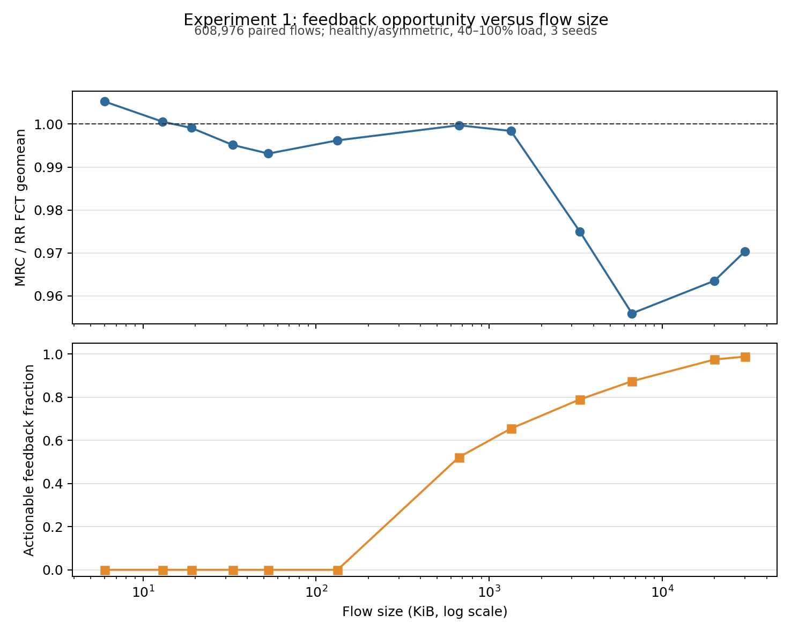
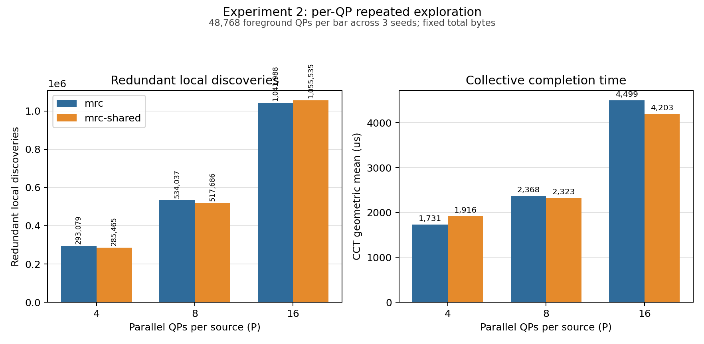
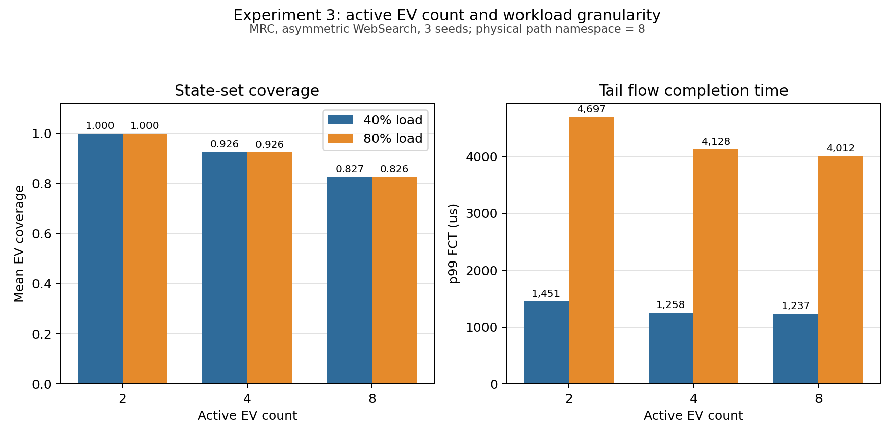

# MRC 固有局限：控制变量验证结果与证据

## 结论先行

本次结果不支持“MRC 失败”，而支持一个更具体的边界判断：

> MRC 适合有足够反馈轮次、且路径差异具有持续性的长生命周期通信；它的 per-QP、反馈驱动设计在短流、高并发和大 EV 状态集合下存在可重复的机制成本。

| 场景 | 结果 | 机制解释 | 适用判断 |
|---|---|---|---|
| 6–133 KiB WebSearch 流 | 当前流的 actionable feedback 为 **0**；6 KiB 的 MRC/RR FCT 几何均值为 **1.0053** | 流结束前没有足够的“反馈返回后新数据选择”，本流无法靠自身反馈学习 | 不应期待 MRC 学习收益；RR 可视为相同选路器的无状态基线 |
| 3.3–30 MiB 流 | actionable feedback 从 **79.0%** 增至 **98.8%**；混合健康/非对称场景后的 MRC/RR FCT 几何均值为 **0.9559–0.9750** | 有足够后续包消费反馈状态，但收益还取决于是否存在持续、可绕开的路径差异 | MRC 具备生效条件，不代表必然获得大收益 |
| 非对称 WebSearch | 40/60/80/100% 负载下，MRC/RR FCT 几何均值均小于 1，三个 seed 全部改善 | 路径差异持续，反馈具有预测性 | MRC 有效 |
| 健康低负载 WebSearch | 40/60% 下 FCT 几何均值为 **1.00033/1.00057**，均只有 1/3 seed 改善 | 没有持续坏路可学习，其他流的状态响应只是在闭环中重新分配排队 | 收益下降，可能轻微变差 |
| 高并发 QP | 独立 MRC 的重复发现从 P4 的 **293,079** 增至 P16 的 **1,041,988**，总 QP 和总字节不变 | 每个 QP 独立发现相同路径状态，认知不能复用 | per-QP 重复探索被直接证实 |
| 最小公共视角 | 跨 QP 消费从 P4 的 **528,709** 增至 P16 的 **2,126,559**；CCT 在 P4 变差 10.7%，P16 改善 6.6% | 共享能减少盲发，但同步传播冷却也会移除容量并引起新一轮路径竞争 | 共享有价值，但不能无条件广播所有状态 |
| EV 数量 K=2/4/8 | 40% 负载下覆盖率 **1.000/0.926/0.827**，未用 EV **0/0.296/1.387**；K4→K8 的 p99 只再改善 1.68% | 更多候选提高多样性，但短流无法等比例利用状态 | 存在边际收益递减；K 越大不等于学习越充分 |

证据等级：

- **控制变量证实**：同 traffic matrix、同 seed，只改变待验证机制；三个 seed 的方向单独报告；
- **直接机制证据**：来自逐流或共享键状态机计数，不依赖 FCT 相关性推断；
- **总体支持**：汇总方向明确，但 seed 或分位数存在反例；
- **描述性机制一致**：处理后分桶与性能同向，能解释现象，但不能单独当作因果估计。







---

## 对照方案与控制变量

### RR 是 MRC 的无状态版本

本实验没有创建新的 `MRC-static`。RR 与 MRC 使用相同的 EV 编码、EV 初始化、EV→物理路径映射和轮转选择器；DCQCN、ACK/SACK/NACK、重传和可靠性恢复保持不变。两者唯一的实验差异是：

- `RR` 不让 ACK/ECN/NACK 改变后续路径选择状态；
- `MRC` 让每个 QP 的反馈更新自身 EV 状态。

因此，`MRC / RR` 衡量的是“启用 per-QP 路径学习后的闭环效果”，不是拿两个不同选路算法做相关性比较。健康场景下已经单独验证 RR 与无反馈 MRC 的端侧选择完全一致，见 [`rr_stateless_mrc_validation.md`](output/rr_stateless_mrc_healthy_seed13/rr_stateless_mrc_validation.md)。

### MRC-shared 只增加公共路径质量视角

`MRC-shared` 的共享键固定为：

`(source NIC, destination ToR, EV)`

它只共享实际端点反馈触发的路径质量状态和更新时间。下列状态仍然属于各 QP 私有：

- DCQCN 和速率控制状态；
- ACK/SACK/NACK 与重传状态；
- EV 轮转 cursor；
- 传输窗口、完成状态和可靠性恢复；
- 每个 QP 消费共享 generation 的记录。

实验 2 没有使用 NetAware 或 Avail 作为对照，因为它们除共享范围外还有其他机制差异，无法把结果归因于 per-QP 状态。

### EV 数量不改变物理路径空间

实验 3 始终保留 8 条物理路径及相同 EV→path 映射，只改变每个 QP 实际维护和轮询的活跃 EV 前缀 `K=2/4/8`。因此 K 的变化不是拓扑路径数变化。

---

## 实验 1：短流没有足够时间消费反馈

### 验证问题

MRC 需要先发送、再收到端到端反馈、更新本 QP 的 EV 状态，最后还要有后续新数据选择才能使用该状态。流只完成 EV 轮转，不代表它完成了路径学习。

本实验使用仓库已有 WebSearch 流大小，不人为定义新的字节边界。最终按实际机制量分组：

- `effective_state_updates`：流完成前产生的有效路径状态变化；
- `new_selections_after_first_update`：第一次更新后还有多少新数据选择；
- `actionable_feedback`：反馈返回后仍有足够新数据使其可能影响本流；
- `unique_active_evs / active_evs`：实际路径状态覆盖率。

### 流大小直接证据

下表汇总 608,976 条同 flow_id、同端点、同大小的 RR/MRC 严格配对流，覆盖健康/非对称、40–100% 负载和三个 seed。

| 流大小 | 流数 | actionable feedback | EV 覆盖 | MRC/RR FCT 几何均值 | 解释 |
|---:|---:|---:|---:|---:|---|
| 6 KiB | 90,170 | **0.0%** | 25.0% | **1.0053** | 未覆盖大部分 EV，且总体轻微变差 |
| 13 KiB | 30,114 | **0.0%** | 50.0% | 1.0006 | 基本无学习收益 |
| 19 KiB | 61,144 | **0.0%** | 62.5% | 0.9991 | 基本持平 |
| 33 KiB | 61,266 | **0.0%** | 100% | 0.9951 | 完成轮转，但反馈仍来不及作用 |
| 53 KiB | 79,426 | **0.0%** | 100% | 0.9931 | 同上 |
| 133 KiB | 42,716 | **0.0%** | 100% | 0.9962 | 同上 |
| 667 KiB | 61,234 | 52.1% | 100% | 0.9997 | 有反馈机会，但总体仍接近持平 |
| 1.3 MiB | 61,178 | 65.4% | 100% | 0.9984 | 学习机会增加，收益仍弱 |
| 3.3 MiB | 61,294 | 79.0% | 100% | **0.9750** | 长流收益出现 |
| 6.7 MiB | 42,788 | 87.4% | 100% | **0.9559** | 本次最明显的学习收益 |
| 20 MiB | 11,834 | 97.4% | 100% | **0.9635** | 反馈可作用率高；混合口径稀释了有坏路场景的收益 |
| 30 MiB | 5,812 | 98.8% | 100% | **0.9704** | 反馈可作用率高，但高负载下可绕开的剩余容量有限 |

这里的 97%–99% 只能证明反馈在流结束前仍有后续发送可以消费，不能证明性能收益“充分”。上表把健康与非对称场景、40%–100% 负载汇总在一起；健康场景没有持续坏路，长流的 MRC/RR 基本为 1，因此会把非对称场景的收益显著稀释。

只保留非对称场景后，长流结果如下：

| 非对称负载 | 6.7 MiB | 20 MiB | 30 MiB | 解释 |
|---:|---:|---:|---:|---|
| 40% | 0.9840 | 0.9721 | 0.9588 | 网络较空，坏路带来的排队代价有限 |
| 60% | **0.9142** | **0.8926** | **0.8920** | 有持续路径差异，同时仍有可用替代容量 |
| 80% | **0.8775** | **0.9072** | **0.9441** | MRC 收益最明显，但超长流开始受全局排队影响 |
| 100% | **0.9158** | **0.9489** | **0.9583** | 压力继续增加后，多条路径同时拥塞，可绕行空间缩小 |

对应健康场景的上述长流比值约为 0.999–1.003。由此可见，聚合后的 0.95 左右不是反馈机制只能改善 5%，而是“有坏路时约 6%–12% 的收益”和“无坏路时约 0% 的收益”混合后的结果。压力也不是越大越好：40% 时绕开坏路的价值较小，60%–80% 同时具备路径差异和剩余容量，是本实验中的有效区间；100% 时全局拥塞压缩了选路能够解决的空间。

另有一组使用当前主分支重新执行的 60%/80% 聚焦实验，直接展示了短流 actionable 为 0、3.3 MiB 后收益开始出现的转折，见 [`mrc_pressure_transition_example.md`](mrc_pressure_transition_example.md)。

直接机制结论是：

`短流选择次数不足 → EV 覆盖不足或反馈返回太晚 → 本流没有后续选择消费状态 → MRC 退化为近似无状态轮转`

33–133 KiB 的流已经覆盖全部 8 个 EV，但 actionable feedback 仍为 0。这区分了两个容易混淆的概念：

- **路径被选过**不等于**路径质量被学到并再次使用**；
- 增加候选路径只能提高探索空间，不能缩短端到端反馈环。

### 反馈在什么场景可能使性能变差

健康场景没有持续坏路，MRC 的整体收益接近零：

| 健康负载 | MRC/RR FCT 几何均值 | 改善 seed | RR p99 FCT | MRC p99 FCT | 判断 |
|---:|---:|---:|---:|---:|---|
| 40% | **1.00033** | 1/3 | 1225.67 μs | 1224.48 μs | 均值轻微变差，p99 基本持平 |
| 60% | **1.00057** | 1/3 | 2032.30 μs | 2023.80 μs | 均值轻微变差，p99略好 |
| 80% | 0.99841 | 2/3 | 3809.80 μs | 3793.26 μs | 小幅改善 |
| 100% | 0.99642 | 3/3 | 6607.44 μs | 6594.99 μs | 小幅改善 |

这不是“某条短流自己的反馈伤害了它”。6–133 KiB 的当前流没有 actionable feedback；差异来自其他较长流启用 MRC 后改变路径使用和排队，再间接影响短流。它说明健康、短流占比高的 workload 中，学习状态未必带来净收益。

对 156,725 条 MRC 比 RR 慢 5% 以上的流，互斥机制计数如下：

| 机制分桶 | 流数 | 占变慢流 | 证据含义 |
|---|---:|---:|---|
| 没有有效状态更新 | 72,942 | 46.54% | 不能把变慢归因于本流学习；主要是闭环排队再分配 |
| 更新后最多剩 1 次新选择 | 30,855 | 19.69% | 反馈到达太晚，与变慢一致 |
| 冷却结束后的首个反馈为 clean | 52,343 | 33.40% | 状态保持时间可能超过拥塞持续时间，存在 stale state |
| 同时冷却多个 EV 且替代路径拥塞 | 92 | 0.06% | 容量移除在本实验 1 中存在，但不是主要计数来源 |
| 未解释 | 493 | 0.31% | 当前诊断不足 |

“更新太晚”组共 67,712 条流，描述性 MRC/RR FCT 几何均值为 1.1093；actionable 组为 0.9796。这个分桶由 MRC 运行后的状态定义，属于处理后变量，所以只能证明“过晚反馈与变慢机制一致”，不能单独当作因果效应。

### MRC 有效的场景

非对称场景中，路径差异持续存在，MRC 的收益明显且三个 seed 一致：

| 非对称负载 | MRC/RR FCT 几何均值 | 改善 seed | RR p99 FCT | MRC p99 FCT | p99 变化 |
|---:|---:|---:|---:|---:|---:|
| 40% | 0.99368 | 3/3 | 1279.36 μs | 1237.37 μs | -3.28% |
| 60% | 0.97765 | 3/3 | 2394.94 μs | 2106.14 μs | -12.06% |
| 80% | 0.98780 | 3/3 | 4630.22 μs | 4012.48 μs | -13.34% |
| 100% | 0.98645 | 3/3 | 7370.96 μs | 6866.66 μs | -6.84% |

因此，决定 MRC 是否有效的不是“流越大越好”这一条规则，而是两个条件同时成立：

1. 流有足够反馈后新选择；
2. 被学习的路径质量差异在后续选择时仍然有效。

---

## 实验 2：per-QP 状态导致重复探索

### 验证问题

总连接数、每 QP 业务量和背景流保持不变，只把每源同时活跃 QP 从 P=4 增加到 P=8/P=16。若 MRC 的路径认知不能跨 QP 复用，相同路径问题会被越来越多 QP 独立发现。

每个方案、每个 P 汇总三个 seed，共 48,768 个前景 QP。核心指标是：

- `redundant_discoveries`：已有其他 QP 发布同键状态后，本 QP 又独立发现；
- `shared_updates_from_other_qps`：本 QP 实际消费其他 QP 更新；
- `post_shared_bad_ev_sends`：其他 QP 已发布该键状态后，独立 MRC 仍向该 EV 发送的新数据选择；
- CCT/p99 FCT：共享状态进入闭环后的次级性能结果。

### 重复探索随并发增长

| P | MRC 重复发现 | MRC-shared 重复发现 | shared 相对 MRC | 跨 QP 消费 | shared/MRC CCT | CCT 改善 seed |
|---:|---:|---:|---:|---:|---:|---:|
| 4 | 293,079 | 285,465 | -2.60% | 528,709 | **1.1072** | 0/3 |
| 8 | 534,037 | 517,686 | -3.06% | 993,221 | **0.9811** | 2/3 |
| 16 | 1,041,988 | 1,055,535 | +1.30% | 2,126,559 | **0.9341** | 2/3 |

在总 QP 和总前景字节不变时，独立 MRC 的重复发现从 P4 到 P16 增加 **3.55 倍**。这是 per-QP 重复探索的直接证据，不需要依赖 FCT 相关性。

独立 MRC 在其他 QP 已发布同键状态后，仍有：

- P4：11,500,694 次后续 EV 发送；
- P8：10,386,628 次；
- P16：11,083,076 次。

这些计数表示“公共视角可介入的机会”，不等于每一次发送都必然产生丢包或更长 FCT。

### 公共视角有效，但简单共享不保证更快

MRC-shared 确实消费了来自其他 QP 的状态；共享不是空实现。效果随并发发生翻转：

- P4：CCT 增加 10.72%，三个 seed 全部变差；虽然 pooled p99 降 1.47%，seed 方向不一致；
- P8：CCT 降 1.89%，2/3 seed 改善；pooled p99 降 1.00%；
- P16：CCT 降 6.59%，2/3 seed 改善；pooled p99 只降 0.10%，逐流 FCT 几何均值反而增加 1.97%。

P16 中 shared 的重复发现还比独立 MRC 多 1.30%。这说明简单公共状态存在另一条反馈链：

`一个 QP 发布冷却 → 同域 QP 同时避开该 EV → 替代路径竞争加重 → 更多反馈状态变化或重复发现`

因此实验 2 支持两个同时成立的结论：

1. **MRC 缺少跨 QP 状态复用，重复探索会随并发扩大。**
2. **把一个 QP 的学习直接用于所有同域 QP 不是无条件最优。** 公共状态至少需要陈旧度、置信度、观察者数量或作用范围控制。

本实验没有证明某个成熟共享算法一定优于 MRC；它验证的是共享这一单一控制变量会产生什么闭环结果。

---

## 实验 3：EV 数量与流粒度存在匹配问题

### 验证问题

短流可完成的路径选择次数和反馈轮次有限。增加活跃 EV 数可能提高路径多样性，也可能增加从未使用或无法学到有效状态的槽位。

### 覆盖、状态浪费和 FCT

| 负载 | K | EV 覆盖率 | 完整 sweep 流 | 平均未用 EV | actionable | MRC p99 FCT | MRC/RR FCT 几何均值 | 改善 seed |
|---:|---:|---:|---:|---:|---:|---:|---:|---:|
| 40% | 2 | 1.000 | 100.0% | 0.000 | 28.25% | 1451.08 μs | 0.99047 | 3/3 |
| 40% | 4 | 0.926 | 85.20% | 0.296 | 21.04% | 1258.48 μs | 0.99585 | 3/3 |
| 40% | 8 | 0.827 | 70.20% | 1.387 | 18.83% | 1237.37 μs | 0.99368 | 3/3 |
| 80% | 2 | 1.000 | 100.0% | 0.000 | 37.23% | 4696.73 μs | 0.98389 | 3/3 |
| 80% | 4 | 0.926 | 85.18% | 0.296 | 35.28% | 4127.65 μs | 0.99442 | 3/3 |
| 80% | 8 | 0.826 | 70.20% | 1.388 | 31.14% | 4012.48 μs | 0.98780 | 3/3 |

K=2 的 100% 覆盖不能解释为最好：它只需要选择两个 EV 就能“全覆盖”，但可用多样性也最低。路径多样性从 K2→K4 带来明显 p99 改善：

- 40%：-13.27%；
- 80%：-12.12%。

从 K4→K8 的边际改善已经下降：

- 40%：p99 再改善 1.68%，平均未用 EV 从 0.296 增至 1.387；
- 80%：p99 再改善 2.79%，平均未用 EV 从 0.296 增至 1.388。

同时，MRC 相对 RR 的配对几何均值并不随 K 单调改善。增加 EV 的主要收益是路径多样性，不是让反馈学习自动更有效。

因此可以确认：

- 大 EV 集合对短流存在未使用状态和探索不足；
- 更多 EV 仍可能通过路径多样性改善尾延迟；
- 当前 8 路、WebSearch 场景中 K=4 是状态利用率与多样性的较好折中，但这不是可直接外推的固定最优值。

---

## MRC 的适用边界

| 维度 | MRC 收益较高 | MRC 收益下降或风险上升 |
|---|---|---|
| 流生命周期 | 多个反馈周期、反馈后仍有大量新包 | 流在首个有效反馈前或刚反馈后结束 |
| 路径状态 | 持续非对称、坏路在后续仍然坏 | 健康均匀网络、短时队列噪声 |
| QP 并发 | 少量长期 QP，单 QP 学习可被充分利用 | 大量 QP 同时独立探索相同域 |
| EV 集合 | 候选数与流可用选择次数匹配 | EV 数远大于短流可探索/可学习状态 |
| 状态共享 | 私有状态避免跨流错误传播 | 私有状态造成重复探索；无门控共享又可能同步移除容量 |

最终结论不是“应删除 MRC”，而是：

- 对长生命周期 AI training communication，MRC 的反馈状态有足够时间摊销，持续非对称下收益明确；
- 对短 RPC/WebSearch 流，MRC 更接近“带闭环干扰的无状态轮转”，不应把大 EV set 当作现成学习收益；
- 对高并发 QP，值得增加有限的公共视角，但共享对象应是带 age/confidence 的路径事实，而不是无条件复制每个瞬时冷却状态；
- EV 数量应与预期包数、反馈 RTT 和可作用反馈轮次联合配置。

---

## 实验范围、稳健性与限制

### 已完成的完整性检查

- 128 节点、8 物理路径、三个 canonical seed：13/29/47；
- 102/102 单元有效，所有单元 `returncode=0`、配置指纹匹配且无解析错误；
- 2,292,990 条逐流诊断，等于 102 个 cells 的连接数之和；
- 1,146,495 条严格配对流，等于 51 个 baseline cells 的连接数之和；
- 51 个方案对均具有相同 traffic SHA 和连接数；
- RR/MRC、MRC/MRC-shared 和不同 K 的物理拓扑、DCQCN、可靠性语义不变。

### 为什么使用 128 节点

128 节点已经产生：

- 实验 2 每个单元 16,256 个前景 QP；
- P4/P8/P16 三档并发；
- 超过 100 万次的重复发现计数；
- 清晰的 P4→P16 扩展趋势。

512 节点会显著增加运行和状态数据规模，但不改变 per-QP 独立学习或反馈生命周期机制。本轮不增加 512 节点；若未来验证交换结构层次或更大故障域，512 才是新的实验变量。

### 必须保留的 caveat

- 这是 htsim 仿真证据，不是硬件测量；绝对 FCT 和共享实现成本不能直接外推；
- 三个 seed 足以检查方向一致性，但没有构造统计置信区间；
- WebSearch 使用仓库的离散化 proxy CDF，结论适用于本次已有流大小集合；
- 非对称场景是持续带宽差异，不是路径失效或动态故障；
- MRC-shared 是最小控制变量消融，不包含 age/confidence/quorum 等成熟共享策略；
- 单流机制分桶是处理后变量，只用于解释一致性，不单独声称中介因果；
- 本轮按要求**不纳入故障实验**，不对故障发现时间、EV 淘汰时间或恢复时间下结论。

整体可信度评估：**可分享，但需带上述 caveat。**

---

## 下一步最值得做的实验

1. **带陈旧度和置信度的公共视角**：保持共享键不变，只增加 TTL、多个 QP 观察 quorum 或持续性门槛，验证能否保留 P16 CCT 收益并消除 P4 回退。
2. **按预计反馈机会自适应 K**：用流大小或剩余包数选择 K，而不是固定 2/4/8，比较状态利用率与尾延迟。
3. **隔离共享引发的容量移除**：记录同一键被多少 QP 同时消费、替代 EV 的队列变化和恢复时间。
4. **更广 workload 验证**：增加已有训练 collective 和 RPC workload，但继续使用同 traffic、同 seed 的 RR/MRC 配对。
5. **故障实验保持独立**：若未来纳入路径失效，单独验证被动发现和恢复，不与本轮固有局限证据混合。

## 数据来源与复现

- 正式运行清单与 SHA：[`manifest.json`](output/mrc_inherent_limitations_128/manifest.json)；
- 102 个单元状态：[`cells.csv`](output/mrc_inherent_limitations_128/cells.csv)；
- 紧凑汇总：[`summary.csv`](output/mrc_inherent_limitations_128/summary.csv)；
- 流大小汇总：[`flow_size_summary.csv`](output/mrc_inherent_limitations_128/flow_size_summary.csv)；
- 总行数统计：[`report_stats.json`](output/mrc_inherent_limitations_128/report_stats.json)；
- 自动生成的基础报告：[`mrc_inherent_limitations_report.md`](output/mrc_inherent_limitations_128/mrc_inherent_limitations_report.md)；
- 实验 1 图：[`exp1_feedback_value_by_flow_size.png`](output/mrc_inherent_limitations_128/figures/exp1_feedback_value_by_flow_size.png)；
- 实验 2 图：[`exp2_per_qp_repeated_exploration.png`](output/mrc_inherent_limitations_128/figures/exp2_per_qp_repeated_exploration.png)；
- 实验 3 图：[`exp3_active_ev_coverage_and_fct.png`](output/mrc_inherent_limitations_128/figures/exp3_active_ev_coverage_and_fct.png)；
- 运行与聚合脚本：[`run_mrc_inherent_limitations.py`](run_mrc_inherent_limitations.py)。

完整本地审计数据还包括：

- `flow_metrics.csv`：2,292,990 条逐流记录；
- `paired_flow_metrics.csv`：1,146,495 条严格配对记录；
- `shared_key_metrics.csv`：866,065 条共享键记录；
- 每单元压缩 stdout、逐流 JSON 和共享事件 JSON。

完整审计数据约 1.8 GiB，位于 `output/mrc_inherent_limitations_128/`，默认不纳入 Git；紧凑统计、图和本报告用于版本化交付。

复现命令：

```bash
python3 experiments/n-mrc/run_mrc_inherent_limitations.py run \
  --seeds 13,29,47 \
  --workers 3 \
  --timeout 3600 \
  --out experiments/n-mrc/output/mrc_inherent_limitations_128
```
