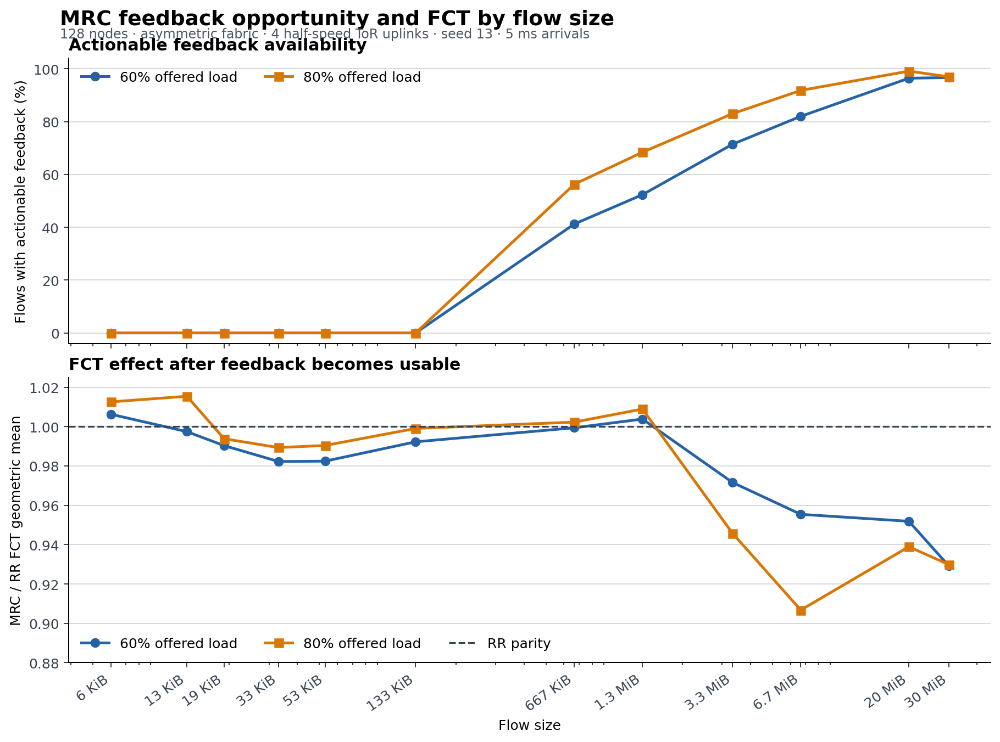

# MRC 高压力流大小转折验证

## 结论

在存在持续路径差异、但仍有替代容量的网络中，MRC 呈现出清晰的流大小转折：

- 6–133 KiB 流即使在 80% offered load 下也没有 actionable feedback，MRC 相对 RR 基本持平，部分点轻微变差；
- 667 KiB–1.3 MiB 流开始有反馈可作用，但 MRC/RR FCT 仍接近 1，说明“反馈来得及”只是必要条件；
- 3.3 MiB 以上流既有较高 actionable feedback，又有足够后续发送持续使用状态，MRC 的 FCT 收益开始明显出现；
- 80% 负载下，6.7 MiB 流的 MRC/RR FCT 几何均值为 **0.9067**，即相对 RR 改善约 **9.3%**。

## `actionable_feedback` 的准确含义

它不是“QP 结束前收到一个反馈就计数”。

一个反馈只有依次满足以下条件，才计入 `actionable_feedback`：

1. ACK/ECN/NACK 使某个 EV 的 MRC 路径状态发生了有效变化；
2. 更新发生在 flow 完成前；
3. 更新之后，该 QP 又执行了至少一次新数据包的 EV 选择。

实现中，有效状态更新先增加 `pending_actionable_updates`。只有下一次新数据选择发生时，这些 pending 更新才转入 `actionable_feedback`；如果两次更新都在下一次发送前到达，这次新选择会一次性确认两次更新均具备可作用机会。因此它衡量的是“有机会影响当前 flow 后续选路的状态更新数”，而不是后续选路次数。

与它不同：

- `quality_feedback_before_done`：完成前收到过多少路径质量反馈，不要求反馈改变状态，也不要求之后还有新数据；
- `effective_state_updates`：反馈确实改变了 EV 状态，但可能来得太晚；
- 表中的 `actionable feedback %`：`actionable_feedback > 0` 的 flow 占全部同大小 flow 的比例，不是平均反馈次数。

例如，80% 负载下 133 KiB 流中有 38.4% 在完成前收到了路径质量反馈，平均也产生了 1.8 次有效状态更新，但 actionable 比例仍为 0：更新之后已经没有新的数据选择，无法影响该流。

## 控制变量

本次聚焦运行使用：

- 128 个节点、8 个物理路径；
- WebSearch 现有离散流大小；
- 60% 和 80% offered load；
- 5 ms 持续流到达窗口，seed 13；
- 随机稀疏选择 4 条 ToR 上行，将其速率降为正常路径的 1/2；
- RR 与 MRC 使用相同 EV 编码、EV→path 映射、轮转选择器、DCQCN、可靠性恢复和流量矩阵；
- 唯一差异是 MRC 允许反馈改变本 QP 后续路径状态，RR 是相同选路器的无状态版本。

4 个仿真单元全部有效。60% 负载下每个方案完成 11,077 条流，80% 下每个方案完成 14,748 条流。

## 80% 高压力结果

| 流大小 | 配对流 | 完成前收到质量反馈 | actionable flow | 平均 actionable 更新数 | MRC/RR FCT 几何均值 | 判断 |
|---:|---:|---:|---:|---:|---:|---|
| 6 KiB | 2,177 | 8.0% | **0.0%** | 0.0 | 1.0125 | 短流无本流学习收益，轻微变差 |
| 13 KiB | 707 | 12.7% | **0.0%** | 0.0 | 1.0154 | 收到反馈不等于来得及使用 |
| 53 KiB | 1,947 | 28.4% | **0.0%** | 0.0 | 0.9904 | 基本持平 |
| 133 KiB | 1,002 | 38.4% | **0.0%** | 0.0 | 0.9990 | 有有效更新，但更新后没有新选择 |
| 667 KiB | 1,516 | 62.8% | 56.3% | 7.4 | 1.0023 | 反馈开始可作用，但收益尚未出现 |
| 1.3 MiB | 1,430 | 71.5% | 68.4% | 13.2 | 1.0089 | 仍接近 RR，反馈机会不是充分条件 |
| 3.3 MiB | 1,500 | 84.3% | **83.0%** | 29.8 | **0.9457** | 学习收益开始明显 |
| 6.7 MiB | 1,049 | 92.4% | **91.8%** | 53.6 | **0.9067** | 相对 RR 改善约 9.3% |
| 20 MiB | 333 | 99.1% | **99.1%** | 109.9 | **0.9389** | 反馈闭环持续工作 |
| 30 MiB | 131 | 96.9% | **96.9%** | 139.2 | **0.9299** | 相对 RR 改善约 7.0% |

短流中出现的少量 FCT 差异不能归因于该流自己的 MRC 学习，因为它们的 actionable feedback 为 0。这些差异来自其他较长 MRC 流改变路径使用后产生的排队外部性。

## 60% 压力复核

60% 负载重现了相同转折，但收益略弱：

| 流大小 | actionable flow | MRC/RR FCT 几何均值 |
|---:|---:|---:|
| 6 KiB | 0.0% | 1.0063 |
| 133 KiB | 0.0% | 0.9922 |
| 667 KiB | 41.2% | 0.9994 |
| 1.3 MiB | 52.3% | 1.0038 |
| 3.3 MiB | 71.4% | **0.9716** |
| 6.7 MiB | 82.0% | **0.9554** |
| 20 MiB | 96.4% | **0.9519** |
| 30 MiB | 96.7% | **0.9292** |

## 为什么还需要持续压力

另一次 1 ms 到达窗口校准中，长流的 actionable 比例同样可以达到 76%–100%，但大部分 MRC/RR 仍在 0.97–1.00。原因是到达窗口过短，队列和慢路竞争没有形成足够持续的稳态。

这说明 MRC 生效至少需要三个条件同时成立：

1. 反馈在 flow 结束前返回；
2. 更新后还有足够新数据选择；
3. 路径质量差异持续存在，并且其他路径仍有可利用容量。

所以实验结论不应写成“actionable feedback 多就必然改善”，而应写成：

> 在持续路径压力下，随着流大小增加，反馈从不可作用变为可作用；当反馈能够被后续足够多次选路持续消费时，MRC 才开始明显优于无状态 RR。

## 数据与复现记录

- 聚焦汇总：[`focused_summary.csv`](output/mrc_pressure_transition_examples_5ms/focused_summary.csv)
- 结果图：[`focused_transition.png`](output/mrc_pressure_transition_examples_5ms/focused_transition.png)
- 原始逐流诊断：`output/mrc_pressure_transition_examples_5ms/raw/`
- 1 ms 校准结果：`output/mrc_pressure_transition_examples/focused_summary.csv`
- 相同输入下 MRC 与 SGLB 的完整方案对比：[`mrc_sglb_pressure_transition_example.md`](mrc_sglb_pressure_transition_example.md)
