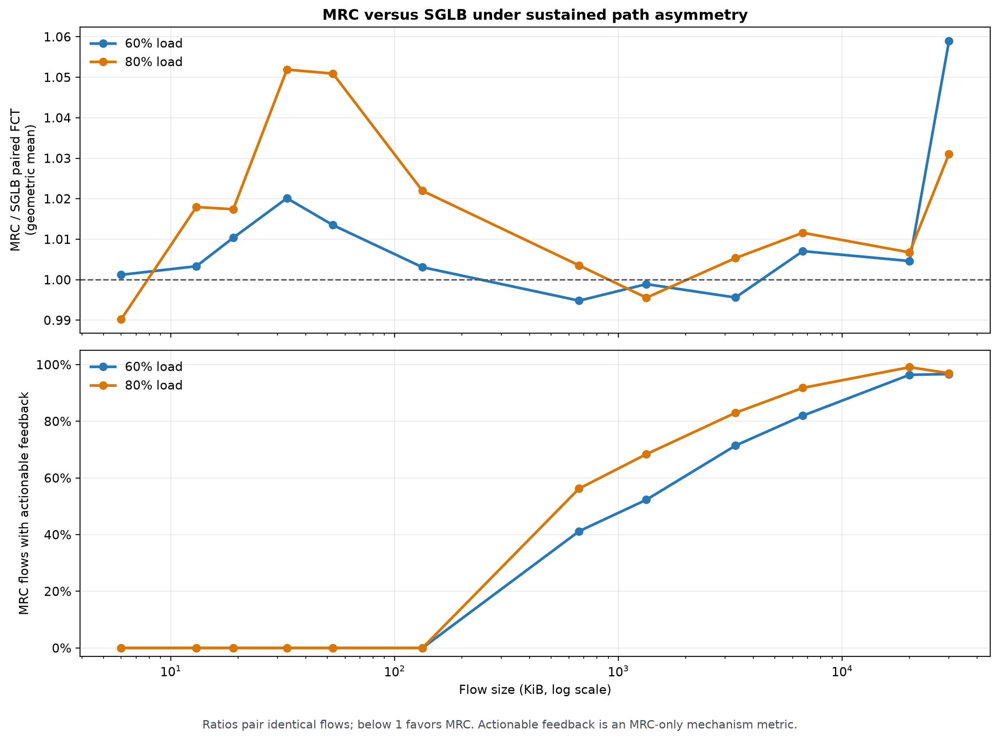
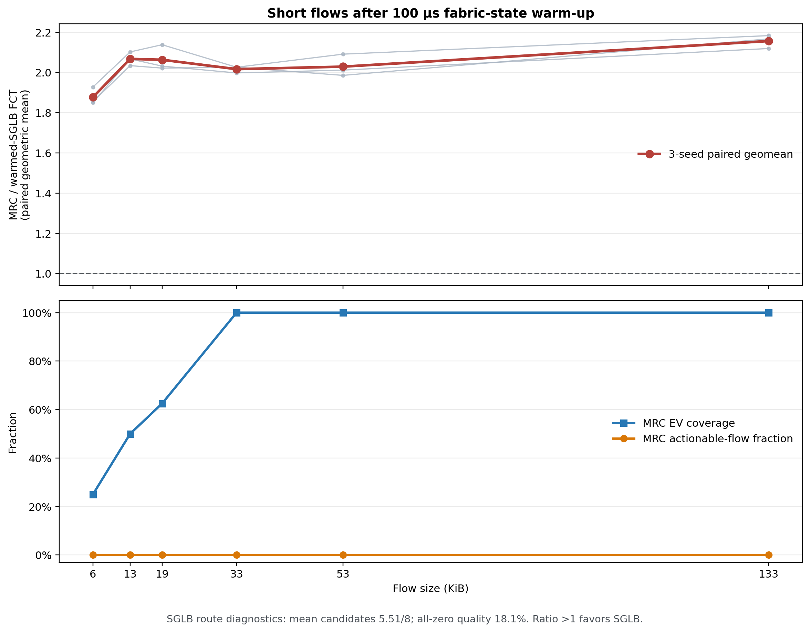
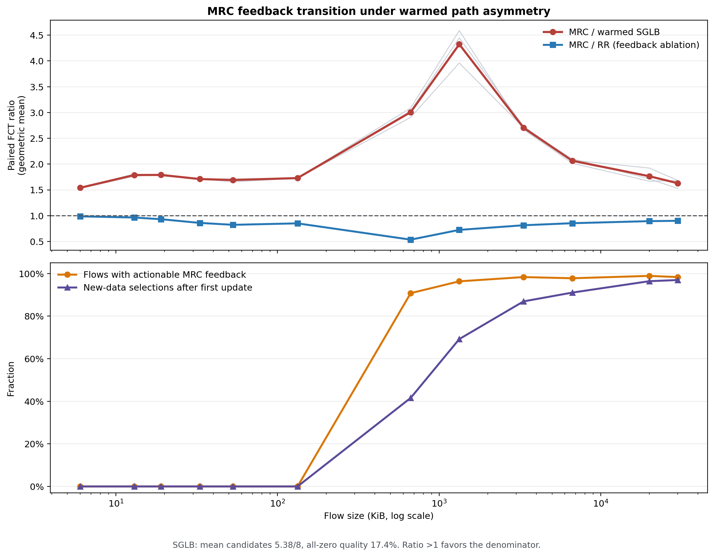

# MRC 与 SGLB 高压力流大小转折对比

## 结论

原 `focused_transition.png` 比较的是 **MRC 与 RR**。其中 RR 是 MRC
相同端侧 EV 编码和轮转选路器的无反馈版本，因此该对比适合隔离 MRC
反馈学习的增量价值。

本轮保持原实验输入不变，将比较对象换成当前默认 **SGLB**。结果与
MRC/RR 明显不同：

- 短流中 MRC 没有 actionable feedback，而 SGLB 可以直接使用交换机侧
  跨流状态；80% 负载下，6–133 KiB 短流的 MRC/SGLB 配对 FCT 几何均值
  为 **1.0243**，MRC 总体慢约 2.4%；
- 中流中两者基本持平：60% 和 80% 负载下分别为 **0.9968** 和
  **0.9997**；
- 长流中 MRC 虽然有充分反馈，但没有像相对 RR 时那样形成明显优势：
  60% 和 80% 负载下分别为 **1.0032** 和 **1.0088**；
- 因此，“MRC 随流变长开始优于无状态 RR”不能外推为“MRC 随流变长
  必然优于已有状态感知方案”。在这组持续路径差异输入中，SGLB 已经
  消化了大部分可由路径状态带来的收益。

图中上半部分是严格配对后的 `MRC FCT / SGLB FCT` 几何均值，小于 1
表示 MRC 更快；下半部分仍是 MRC 自身的 actionable-flow 比例，只用于
解释 MRC 反馈闭环何时具备作用机会，不是 SGLB 的反馈指标。

## 条件性证明：SGLB 已有公共视角时，短流中的 MRC 明显处于劣势

原混合 WebSearch 实验不能证明“极短流必然由 SGLB 获胜”。其中 80%
负载的 6 KiB 点为 0.9903，MRC 反而快约 1%；SGLB 诊断也显示 88.5%
的选路调用看到所有候选都是零质量压力，平均保留 7.81/8 个候选。也就是
说，SGLB 虽然可以使用交换机状态，但在状态没有区分度时仍近似全路径喷洒，
不是时刻都能有效改路。

为验证更准确的条件命题，新增一个预热短流实验：

- 128 节点、8 路、seeds 13/29/47；
- 每个 seed 对 6/13/19/33/53/133 KiB 各生成 1,000 条流，共
  18,000 条严格配对流；
- 5 条固定 hot path 从 0 μs 开始承载 380 Gbit/s 背景，保留 3 条
  clean path；
- 前景短流从 100–600 μs 到达，晚于 SGLB 的 1 μs 本地和 5 μs
  下游状态更新周期；
- MRC 与 SGLB 复用同一 traffic、seed、背景、拓扑、传输和队列配置，
  只改变 `-lb`。

保留 3 条 clean path 是必要控制：SGLB 默认最少保留 3 个候选。如果只有
2 条 clean path，它会继续把下一整个质量档加入候选，重新混入 hot path。

| 流大小 | 配对流 | MRC 收到质量反馈 | MRC actionable | 更新后新选择 | EV 覆盖 | MRC/SGLB FCT | seed 范围 | p99 比值 |
|---:|---:|---:|---:|---:|---:|---:|---:|---:|
| 6 KiB | 3,000 | 74.2% | **0.0%** | 0.0 | 25.0% | **1.8768** | 1.849–1.928 | 3.55 |
| 13 KiB | 3,000 | 84.4% | **0.0%** | 0.0 | 50.0% | **2.0676** | 2.034–2.102 | 3.62 |
| 19 KiB | 3,000 | 84.9% | **0.0%** | 0.0 | 62.5% | **2.0631** | 2.022–2.138 | 3.58 |
| 33 KiB | 3,000 | 86.8% | **0.0%** | 0.0 | 100% | **2.0165** | 1.998–2.026 | 3.31 |
| 53 KiB | 3,000 | 87.7% | **0.0%** | 0.0 | 100% | **2.0290** | 1.986–2.091 | 3.45 |
| 133 KiB | 3,000 | 90.2% | **0.0%** | 0.0 | 100% | **2.1563** | 2.119–2.183 | 3.50 |

这里“没反馈”的准确说法不是完全没有 ACK/ECN/NACK。74%–90% 的 MRC
流在完成前收到过质量反馈，平均产生 1.34–7.31 次有效状态更新；但所有
大小的 `new_selections_after_first_update` 均为 0，所以这些更新来得太晚，
没有任何一个 flow 能用它改变自己的新数据选路，actionable 比例为 0。

与之对应，SGLB 的三个 seed 平均只保留 5.51/8 个候选，只有 18.1% 的
选路调用仍看到全零质量状态。这说明交换机公共视角已经产生实际路径区分，
不是只具备一个没有被使用的状态接口。

因此本实验支持的结论是：

> 当路径压力已经持续足够时间，使 SGLB 的共享 fabric 状态具有区分度，
> 而当前 flow 在首次有效端到端反馈前已发完所有新数据时，per-QP、
> 反馈驱动的 MRC 存在明确冷启动劣势。本实验中 MRC 的典型配对 FCT 是
> SGLB 的 1.88–2.16 倍，三个 seed 方向完全一致。

EV 完整覆盖也不能消除该问题。33–133 KiB 已经覆盖全部 8 个 EV，甚至完成
多轮 sweep，但反馈后的新选择仍为 0；它们只是盲轮询过所有路径，没有来得及
把已学状态用于当前 flow。这将“EV 探索”和“反馈学习生效”区分开来。

这不是“SGLB 对所有极短流必胜”的证明。它是带前提的机制验证：
SGLB 状态必须已经预热、能区分路径，且其 cache/控制传播成本在当前仿真中
没有建模。若所有路径仍处于同一质量档，原混合实验中的 6 KiB 反例仍成立。

## 反馈闭环转折：相对 RR 变好，不等于必然追平 SGLB

### 技术结论

进一步验证支持用户提出命题的前半部分，但不支持无条件的后半部分：

> 短流或长 QP 的初始阶段，MRC 对后续新数据选路没有 actionable
> feedback，可能落后于已有可区分公共视角的 SGLB。反馈开始作用后，
> MRC 相对自身的无状态版本 RR 明显改善；但完整 FCT 相对 SGLB
> 不会立即改善，也不能保证在现有最大 30 MiB 流上已经接近 1。

这里必须把两个比较对象分开：

- `MRC/RR` 隔离 MRC 反馈闭环的增量价值；小于 1 才能证明反馈让 MRC
  自身变好。
- `MRC/SGLB` 比较两个完整方案。SGLB 继续使用跨流共享、周期更新的
  fabric 状态；MRC 闭环生效并不意味着它会获得比 SGLB 更新或更完整的
  公共视角。

### 三 seed 转折矩阵

最终矩阵使用 128 节点、8 路、5 条 hot path、340 Gbit/s 背景压力，
压力从 0 持续到 1,000 μs；所有 QP 从 100–600 μs 启动。MRC、SGLB
和 RR 使用同一个 traffic、seed、拓扑、队列、DCQCN 和可靠性配置，只改变
`-lb`。每个 seed 使用已有 WebSearch 离散流大小，共 20,430 条三方案
严格配对流。

| 流大小 | 配对流 | MRC 收到质量反馈 | actionable flow | 更新后新选择 | MRC/SGLB FCT | seed 范围 | MRC/RR FCT |
|---:|---:|---:|---:|---:|---:|---:|---:|
| 6 KiB | 3,000 | 78.7% | **0.0%** | 0.0% | **1.540** | 1.528–1.549 | 0.987 |
| 13 KiB | 3,000 | 88.7% | **0.0%** | 0.0% | **1.788** | 1.764–1.808 | 0.964 |
| 19 KiB | 3,000 | 89.8% | **0.0%** | 0.0% | **1.790** | 1.770–1.803 | 0.931 |
| 33 KiB | 3,000 | 90.5% | **0.0%** | 0.0% | **1.710** | 1.706–1.714 | 0.859 |
| 53 KiB | 3,000 | 90.8% | **0.0%** | 0.0% | **1.690** | 1.654–1.713 | 0.822 |
| 133 KiB | 3,000 | 91.5% | **0.0%** | 0.0% | **1.729** | 1.727–1.730 | 0.851 |
| 667 KiB | 900 | 93.2% | 90.8% | 41.6% | **3.007** | 2.905–3.088 | **0.535** |
| 1.3 MiB | 900 | 96.4% | 96.3% | 69.2% | **4.323** | 3.960–4.588 | **0.724** |
| 3.3 MiB | 300 | 98.3% | 98.3% | 86.9% | 2.703 | 2.670–2.735 | **0.814** |
| 6.7 MiB | 180 | 98.3% | 97.8% | 91.0% | 2.065 | 2.016–2.102 | **0.854** |
| 20 MiB | 90 | 98.9% | 98.9% | 96.4% | 1.765 | 1.668–1.923 | **0.894** |
| 30 MiB | 60 | 98.3% | 98.3% | 96.9% | **1.629** | 1.527–1.683 | **0.900** |

图和表共同说明三个阶段：

1. **冷启动阶段（6–133 KiB）**：更新后的新数据选择为 0，因此 MRC
   无法把已学路径状态用于当前 flow 的后续新数据；SGLB 已经将平均候选集
   缩到 5.38/8，只有 17.4% 的选路调用看到全零质量。MRC/SGLB 为
   1.54–1.79。
2. **闭环刚生效（667 KiB–1.3 MiB）**：actionable flow 快速升至
   90.8%–96.3%，MRC/RR 降至 0.535–0.724，直接证明反馈让 MRC 比
   无状态轮转好 27.6%–46.5%。但冷启动造成的排队、ECN、重传和降窗已经
   发生，完整 FCT 不能被后来的反馈撤销，因此 MRC/SGLB 反而暂时升到
   3.01–4.32。
3. **长后反馈阶段（3.3–30 MiB）**：首次更新后的新数据选择占比从
   86.9% 增至 96.9%，MRC/SGLB 从峰值 4.323 持续回落到 1.629。
   这证明预热成本正在被更长的闭环阶段摊薄，但在本次 30 MiB 上仍比
   SGLB 慢 62.9%，不能写成“已经追平”。

### actionable 的严格含义

当前 `actionable_feedback` 不是“QP 完成前收到一次反馈就计数”。它要求：

1. MRC 收到反馈并产生一次有效路径状态更新；
2. 此后同一 QP 至少还有一次**新数据**路径选择；
3. 该更新才记为 actionable。

因此 `actionable=0` 只能证明反馈没有作用于后续新数据选择，不能证明
ACK/ECN/NACK 完全没有影响当前 flow。最终矩阵中，短流虽然 actionable
为 0，MRC/RR 已达到 0.822–0.987；这说明反馈仍可能影响恢复/重传路径，
而当前指标没有把这类作用计入 actionable。以后若需要使用“反馈完全没有
作用”这一表述，必须新增恢复选择消费状态的诊断，不能沿用当前计数。

### 稳健性检查与反例

为排除“只是混合流大小互相干扰”，又做了两个端点检查：

| 检查 | 6 KiB MRC/SGLB | 30 MiB MRC/SGLB | 结论 |
|---|---:|---:|---|
| 每个大小独立 cell，无 primer | 0.998 | 3.314 | 6 KiB 时 SGLB 100% 全零，公共视角没有信息 |
| 独立 cell，加入相同 133 KiB primer | 1.252 | 3.547 | primer 使 SGLB 有区分度，但长 QP 仍未追平 |

持续热点的 3-hot/5-hot 标定也得到相同边界：MRC 相对 RR 改善，但
拥有持续公共视角的 SGLB 仍保持优势。这些反例阻止我们把“闭环生效”
直接解释为“MRC/SGLB 必然接近 1”。

较轻的原 WebSearch 稀疏慢路实验中，MRC/SGLB 长流比值确实约为
1.00–1.01；但该场景下短流差距也只有约 0%–2%。因此可以写成场景结论：

- 公共视角区分度弱或路径压力较轻时，两者 FCT 本来就接近；
- 公共视角区分度强时，MRC 短流存在冷启动劣势；
- MRC 闭环会让它相对 RR 变好，并在有限压力后逐步摊薄冷启动成本；
- 但在持续、高并发、共享状态始终有效的输入中，长流也不保证追平 SGLB。

## 控制变量

本轮直接复用原 MRC/RR 聚焦实验的输入：

- 128 个节点、8 条物理路径；
- WebSearch 已有离散流大小，6 KiB–30 MiB；
- 60% 和 80% offered load，5 ms 持续到达窗口，seed 13；
- 随机稀疏选择 4 条 ToR 上行，将速率降为正常路径的 1/2；
- 相同 traffic 文件、连接数、链路速率、队列、DCQCN、Exact+Bounded
  可靠性语义、MTU、hop/switch latency 和仿真截止时间；
- MRC 与 SGLB cell 使用相同 simulator SHA-256
  `05b10989885b85e39b2734e10a7cadaeb4b6fc86a56537f69ae6abbdeae22cec`。

唯一的方案入口差异是 `-lb mrc` 与 `-lb sglb`。但这不是控制变量消融：

- MRC 在源端为每个 QP 独立维护 EV 状态，等待端到端反馈；
- SGLB 在交换机侧使用跨流共享的路径状态，默认每 1 μs 更新本地质量、
  每 5 μs 更新下游 GCN cache，以四级量化和最少三个候选进行逐跳选路。

所以本实验回答的是两个完整方案在相同输入下的性能差异，而不是把差异
全部归因于“是否跨 QP 共享”。

## 分流粒度结果

以下比值均先按相同 `flow_id/src/dst/start/flow_size` 严格配对，再对逐流
FCT 比值取几何均值：

| 负载 | 流粒度 | 配对流 | MRC/SGLB FCT | MRC 胜出流 | MRC p99 / SGLB p99 | 解释 |
|---:|---|---:|---:|---:|---:|---|
| 60% | 6–133 KiB | 6,626 | 1.0090 | 50.4% | 0.9811 | 中心分布基本持平，MRC 总体略慢 |
| 60% | 667 KiB–1.3 MiB | 2,206 | 0.9968 | 52.5% | 0.9423 | MRC 仅有很小的总体优势，但该组 p99 更低 |
| 60% | 3.3–30 MiB | 2,245 | 1.0032 | 53.2% | 0.9796 | 几何均值持平，尾部略偏向 MRC |
| 80% | 6–133 KiB | 8,789 | **1.0243** | 48.1% | 0.9995 | MRC 无本流反馈收益，SGLB 中心分布更好 |
| 80% | 667 KiB–1.3 MiB | 2,946 | 0.9997 | 51.1% | 1.0079 | 基本持平 |
| 80% | 3.3–30 MiB | 3,013 | **1.0088** | 50.0% | 1.0128 | MRC 反馈充分，但 SGLB 仍略好 |

“MRC 胜出流”是 `MRC FCT < SGLB FCT` 的配对流比例。它接近 50% 表明
两方案逐流结果高度交叠，不能只根据少数流大小点宣称全面胜出。

## 离散流大小转折

| 负载 | 流大小 | MRC actionable flow | MRC/SGLB FCT | 判断 |
|---:|---:|---:|---:|---|
| 60% | 6 KiB | 0.0% | 1.0012 | 持平 |
| 60% | 133 KiB | 0.0% | 1.0031 | 持平 |
| 60% | 667 KiB | 41.2% | 0.9948 | MRC 略好 0.5% |
| 60% | 1.3 MiB | 52.3% | 0.9989 | 持平 |
| 60% | 3.3 MiB | 71.4% | 0.9956 | 持平 |
| 60% | 6.7 MiB | 82.0% | 1.0071 | SGLB 略好 |
| 60% | 20 MiB | 96.4% | 1.0046 | 持平 |
| 60% | 30 MiB | 96.7% | **1.0590** | SGLB 更好；该点只有 90 条流 |
| 80% | 6 KiB | 0.0% | 0.9903 | 持平 |
| 80% | 133 KiB | 0.0% | 1.0220 | SGLB 略好 |
| 80% | 667 KiB | 56.3% | 1.0035 | 持平 |
| 80% | 1.3 MiB | 68.4% | 0.9956 | 持平 |
| 80% | 3.3 MiB | 83.0% | 1.0053 | 持平 |
| 80% | 6.7 MiB | 91.8% | 1.0116 | SGLB 略好 |
| 80% | 20 MiB | 99.1% | 1.0067 | 持平 |
| 80% | 30 MiB | 96.9% | **1.0311** | SGLB 更好；该点只有 131 条流 |

这组结果没有出现 MRC/RR 图中的“3.3 MiB 后 MRC 明显胜出”转折。
actionable 比例仍随流大小从 0 增至接近 100%，但 MRC/SGLB 比值仍围绕
1 波动。直接机制解释是：

1. 相对 RR，MRC 的反馈学习是在“无路径状态”之上增加价值；
2. 相对 SGLB，比较对象本身已经通过交换机侧周期状态避开持续慢路；
3. MRC 长流获得的学习收益主要用于追平 SGLB，而不是叠加成新的
   6%–10% 优势；
4. SGLB 不需要等待当前 QP 的端到端反馈，因此对短流更有条件产生收益。

## p99 与几何均值为什么可能方向不同

逐流比值几何均值衡量典型配对流的相对变化；`MRC p99 / SGLB p99` 是两组
FCT 分布分别取 p99 后再相除，两者不是同一个统计量。例如 60% 长流中，
几何均值为 1.0032，表示总体持平且略偏 SGLB，但 p99 比值为 0.9796，
表示 MRC 的该组尾部低约 2.0%。因此本轮结论应保留为“总体接近，部分负载
和尾部各有优劣”，而不是只选其中一个指标宣布胜负。

## 实验限制

- 原 5 ms 混合 WebSearch 矩阵只使用 seed 13；新增预热短流矩阵使用
  seeds 13/29/47；
- 30 MiB 点只有 90/131 条流，5.9%/3.1% 的差异需要三个 seed 才能判断
  是否稳定；
- SGLB cache 通过仿真中的交换机对象共享，没有计入真实 GCN 控制报文的
  传播、带宽、排队和丢失成本；
- 本轮仍是持续带宽差异，不包含动态故障；
- 结果不能用于证明跨 QP 共享一定更优，只能说明当前完整 SGLB 在该输入下
  已经达到与 MRC 相当或略好的 FCT。

## 数据与复现记录

- 运行与聚合脚本：[`run_mrc_sglb_pressure_transition.py`](run_mrc_sglb_pressure_transition.py)
- cell 与 SHA 校验：[`cells.csv`](output/mrc_sglb_pressure_transition_examples_5ms/cells.csv)
- 分流大小汇总：[`focused_summary.csv`](output/mrc_sglb_pressure_transition_examples_5ms/focused_summary.csv)
- 逐流严格配对数据：`output/mrc_sglb_pressure_transition_examples_5ms/paired_flow_metrics.csv.gz`
- PNG 图：[`focused_transition.png`](output/mrc_sglb_pressure_transition_examples_5ms/focused_transition.png)
- PDF 图：[`focused_transition.pdf`](output/mrc_sglb_pressure_transition_examples_5ms/focused_transition.pdf)
- SGLB 原始命令、stdout 和 cell summary：`output/mrc_sglb_pressure_transition_examples_5ms/raw/`
- 预热短流运行脚本：[`run_mrc_sglb_warmed_short_flow.py`](run_mrc_sglb_warmed_short_flow.py)
- 预热短流三 seed 汇总：[`summary.csv`](output/mrc_sglb_warmed_short_flow/summary.csv)
- 预热短流逐 seed 汇总：[`seed_summary.csv`](output/mrc_sglb_warmed_short_flow/seed_summary.csv)
- 预热 SGLB 路由诊断：[`sglb_route_summary.csv`](output/mrc_sglb_warmed_short_flow/sglb_route_summary.csv)
- 预热短流图：[`focused_proof.png`](output/mrc_sglb_warmed_short_flow/focused_proof.png) 和 [`PDF`](output/mrc_sglb_warmed_short_flow/focused_proof.pdf)
- 预热短流逐流数据：`output/mrc_sglb_warmed_short_flow/paired_flow_metrics.csv.gz`
- 反馈转折运行脚本：[`run_mrc_sglb_feedback_transition.py`](run_mrc_sglb_feedback_transition.py)
- 反馈转折三 seed 汇总：[`summary.csv`](output/mrc_sglb_feedback_transition/summary.csv)
- 反馈转折逐 seed 汇总：[`seed_summary.csv`](output/mrc_sglb_feedback_transition/seed_summary.csv)
- 反馈转折 SGLB 路由诊断：[`sglb_route_summary.csv`](output/mrc_sglb_feedback_transition/sglb_route_summary.csv)
- 反馈转折敏感性检查：[`sensitivity_checks.csv`](output/mrc_sglb_feedback_transition/sensitivity_checks.csv)
- 反馈转折图：[`focused_transition.png`](output/mrc_sglb_feedback_transition/focused_transition.png) 和 [`PDF`](output/mrc_sglb_feedback_transition/focused_transition.pdf)
- 反馈转折逐流数据：`output/mrc_sglb_feedback_transition/paired_flow_metrics.csv.gz`
