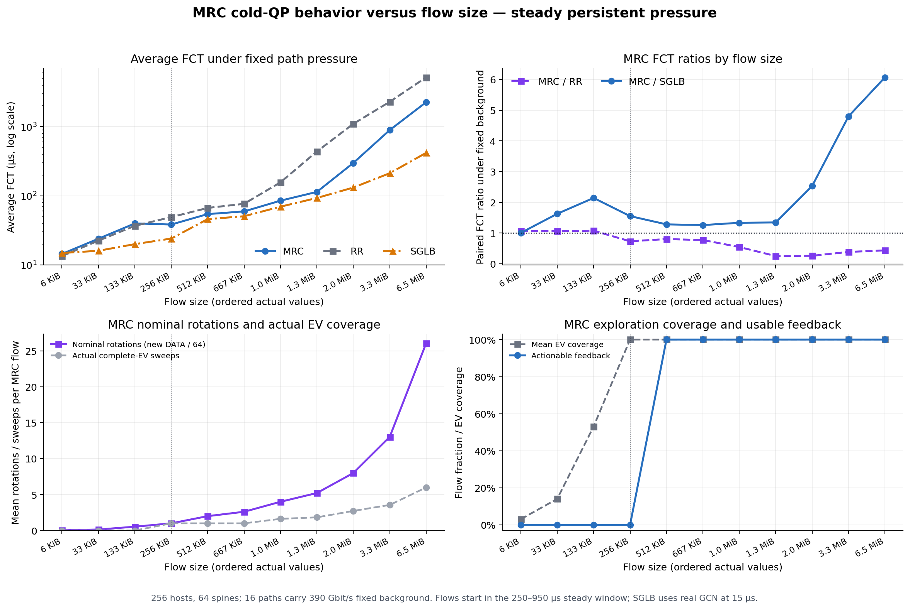
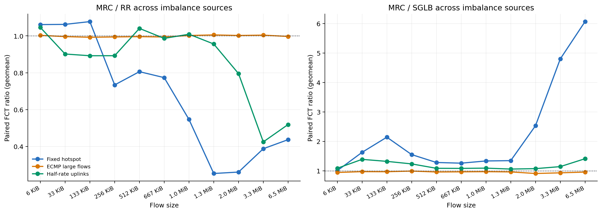

# MRC 生命周期、冷 QP 与独立学习实验

## 结论摘要

- 核心生命周期判断成立。短流 actionable=0，长流=100%；固定热点下长流 MRC/RR=0.413，短流=1.064。
- 控制延迟被直接观测。首次有效反馈最早 7.100 µs，256 KiB 虽完成一轮 64-EV rotation，但反馈后新 DATA 仍为 0。
- **本次固定热点下，MRC 不会自动收敛到 SGLB。** MRC/SGLB 从短流 1.353 扩大到长流 5.431；持续坏路径下 skip-token 只跳过下一次机会，会反复探索，而 SGLB 持续使用 fabric 视图。
- 6 项可证伪判据中支持 5/6 项。结果来自 3 个配对 seed；机制计数逐 flow 验证，不把单一路径哈希当作结论。

上图左上直接给出用户要求的分流长平均 FCT；右上给出同 flow 配对比值；下方把 rotation、实际 sweep、EV 覆盖和 actionable 控制机会与性能转折对齐。

固定热点与半速链路产生了清晰的长流 MRC/RR 改善；显式 ECMP 大流场景的 MRC/RR 接近 1，说明这 3 个 seed 的逐流哈希背景没有让反馈方案拉开差距，不能把这一场景解释成额外正证据。
半速链路中 MRC/SGLB 从 33 KiB 的 1.391 缩小到 1.3 MiB 的 1.061，但到 6.5 MiB 又扩大到 1.412；只能说过渡区间接近，不能说流越长就必然收敛。

## 逐项理论判定

| 理论判据 | 结果 | 关键数据 |
|---|---|---|
| 无可执行反馈的短流近似 RR | 支持 | flows=16748, mrc_rr_gmean=1.06384, equivalence_margin=0.1 |
| 反馈控制至少需要 1 RTT | 支持 | minimum_feedback_delay_us=7.10038, reference_rtt_us=7 |
| 256 KiB rotation 边界仍可能无后续控制 | 支持 | nominal_rotations_mean=1, zero_post_feedback_fraction=1 |
| 可执行反馈比例随生命周期增加 | 支持 | short_fraction=0, long_fraction=1 |
| 长流 MRC 相对 RR 改善 | 支持 | short_mrc_rr_gmean=1.06384, long_mrc_rr_gmean=0.412775 |
| MRC 与 SGLB 差距随流长缩小 | 不支持 | short_mrc_sglb_gmean=1.35304, long_mrc_sglb_gmean=5.43141 |

## 按流大小的结果

所有比值先在相同 seed、相同 flow ID 内配对，再取几何均值。FCT 平均值和 p99 分开报告，p99 不是最大值。

| 流大小 | 固定热点平均 FCT：MRC / RR / SGLB (µs) | 固定热点 p99 FCT：MRC / RR / SGLB (µs) |
|---:|---:|---:|
| 6 KiB | 14.43 / 13.44 / 14.87 | 67.62 / 64.26 / 58.38 |
| 33 KiB | 23.93 / 22.44 / 16.01 | 70.66 / 77.45 / 59.95 |
| 133 KiB | 39.80 / 36.76 / 19.99 | 86.90 / 82.92 / 62.50 |
| 256 KiB | 38.41 / 49.17 / 24.06 | 96.71 / 82.92 / 58.82 |
| 512 KiB | 54.36 / 66.70 / 45.96 | 105.18 / 117.76 / 117.70 |
| 667 KiB | 59.42 / 76.58 / 50.62 | 95.43 / 123.35 / 128.82 |
| 1.0 MiB | 85.02 / 156.70 / 69.60 | 134.32 / 272.92 / 167.41 |
| 1.3 MiB | 113.84 / 437.30 / 93.03 | 238.49 / 563.27 / 209.82 |
| 2.0 MiB | 298.63 / 1099.24 / 131.60 | 558.73 / 1264.19 / 323.70 |
| 3.3 MiB | 892.78 / 2290.51 / 212.15 | 1170.69 / 2556.56 / 624.90 |
| 6.5 MiB | 2259.42 / 5168.55 / 418.27 | 2598.51 / 5581.76 / 1028.82 |

| 流大小 | flows | 固定热点 MRC/RR | 固定热点 MRC/SGLB | ECMP 大流 MRC/RR | 半速链路 MRC/RR | nominal rotation | actual sweep | EV覆盖 | actionable |
|---:|---:|---:|---:|---:|---:|---:|---:|---:|---:|
| 6 KiB | 8352 | 1.0614 | 1.0067 | 1.0031 | 1.0460 | 0.031 | 0.000 | 3.1% | 0.0% |
| 33 KiB | 5023 | 1.0626 | 1.6289 | 0.9962 | 0.9017 | 0.141 | 0.000 | 14.1% | 0.0% |
| 133 KiB | 3325 | 1.0776 | 2.1442 | 0.9926 | 0.8924 | 0.531 | 0.000 | 53.1% | 0.0% |
| 256 KiB | 48 | 0.7339 | 1.5530 | 0.9944 | 0.8925 | 1.000 | 1.000 | 100.0% | 0.0% |
| 512 KiB | 48 | 0.8059 | 1.2845 | 0.9959 | 1.0408 | 2.000 | 1.000 | 100.0% | 100.0% |
| 667 KiB | 48 | 0.7735 | 1.2611 | 0.9941 | 0.9864 | 2.609 | 1.000 | 100.0% | 100.0% |
| 1.0 MiB | 48 | 0.5466 | 1.3362 | 1.0023 | 1.0092 | 4.000 | 1.625 | 100.0% | 100.0% |
| 1.3 MiB | 48 | 0.2532 | 1.3472 | 1.0054 | 0.9561 | 5.219 | 1.833 | 100.0% | 100.0% |
| 2.0 MiB | 48 | 0.2609 | 2.5328 | 1.0024 | 0.7954 | 8.000 | 2.729 | 100.0% | 100.0% |
| 3.3 MiB | 349 | 0.3876 | 4.8007 | 1.0042 | 0.4247 | 13.031 | 3.559 | 100.0% | 100.0% |
| 6.5 MiB | 388 | 0.4368 | 6.0692 | 0.9969 | 0.5190 | 26.047 | 5.990 | 100.0% | 100.0% |

## 跨 seed 一致性

| seed | 短流 MRC/RR | 长流 MRC/RR | 短流 MRC/SGLB | 长流 MRC/SGLB |
|---:|---:|---:|---:|---:|
| 13 | 1.0608 | 0.4136 | 1.3851 | 5.2071 |
| 29 | 1.0645 | 0.4152 | 1.3434 | 5.4278 |
| 47 | 1.0662 | 0.4096 | 1.3320 | 5.6539 |

## 因果解释

- 每个 MRC QP 独立从 64 个 GOOD EV 开始，不继承其他 QP 已经学到的拥塞状态。
- 新 QP 必须先发送 DATA，再等待拥塞 ACK/TRIM 返回；只有反馈之后仍有新的原始 DATA 选择时，当前 flow 才能受益，因此控制至少跨越 1 RTT。
- 4 KiB MTU 下 64 个 nominal slot 等于 256 KiB。nominal rotation 只表示游标机会数；actual sweep 才表示真实覆盖全部 EV，两者不可混称。
- SGLB 使用已预热的交换机侧 dToR profile，因此短流比较反映完整方案差异；它不是只改变‘是否跨 QP 共享’的纯消融。
- 固定热点用于清晰机制证明；显式 ECMP 大流用于构造长期逐流哈希不均衡；半速上行用于检验结论是否依赖合成背景源。
- ‘短流类似 RR’使用 ±10% 的描述性实用等价带；它不是统计等价检验。短流总体 MRC 相对 RR 变化 +6.4%，远小于长流改善 58.7%；6/33/133 KiB 三档分别只变化 +6.1%/+6.3%/+7.8%。
- 256 KiB 的 MRC/RR 改善不能归因于当前 flow 的反馈，因为该档post-feedback DATA 为 0；它来自不同方案造成的队列外部性和恢复轨迹差异。

## 局限性与稳健性

- 本次运行 3 个配对 seed、17,725 条稳态被测流；流级样本量很大，但只有三个独立 traffic/path seeds，因此不把逐流样本数误当成大量独立实验重复。
- ECMP 大流场景结果接近 1，只能作为负结果保留，不能支持 MRC 长流优势。
- MRC/SGLB 是完整方案比较，不是仅改变状态共享的一因素消融。
- 固定 390 Gbit/s 热点是放大反馈作用的机制场景，不代表所有生产负载强度。

## 建议与后续问题

- 将 MRC 定位为长生命周期通信相对 RR 的反馈增强方案，不应宣称它能处理冷启动短流或最终逼近持续 fabric 视图。
- 若要改善短流，应引入跨 QP/ToR-pair 状态共享或网络侧预热信息；单纯增加当前 QP 的 rotation 强度无法绕过至少 1 RTT 的因果延迟。
- 若要处理长期坏路径，需比较累积惩罚或多次 skip 的策略。当前 skip-token每次只跳过一个 opportunity；它是长流仍显著落后 SGLB 的候选解释，但本实验没有单独消融该机制，不能把相关性写成已证实原因。
- 进一步问题：共享 MRC 状态能否在不引入错误继承的前提下缩短短流探索窗口，以及更强的 ECMP 大流哈希偏斜是否会出现与固定热点一致的转折。

## 配置与复现口径

- 256 hosts，4 Leaf，64 Spines，64 paths，400 Gbit/s，4 KiB MTU。
- MRC：64 active EV、identity mapping、skip token、故障恢复关闭。
- SGLB：real 256 B high-priority GCN、dToR profile、15 µs remote cadence、exact-min24、shuffled RR。
- WebSearch-like 前景：短流 offered load 10%，长流 56%，过渡探针约 4.3%；Poisson 到达覆盖 50–1150 µs，只统计 250–950 µs 启动的稳态 flow。
- 固定热点：16/64 paths 持续承载 390 Gbit/s 双向背景；ECMP 背景：16 条 64 MiB 长流在 25 µs 启动并逐流 ECMP；非对称容量：每 Leaf 16 条上联降为半速。
- actionable 定义：MRC 反馈先改变路径状态，且此后同一 QP 至少还有一次新的原始 DATA 路径选择；收到普通 ACK 本身不计 actionable。
- seeds=3；sample_scale=1。
- 稳态被测流数=17725；输入流记录数=27643。
- `steady_paired_flow_metrics.csv.gz` 保存逐流数据；`flow_size_focus.csv` 保存精确绘图数据；`theory_checks.json` 保存判据。
